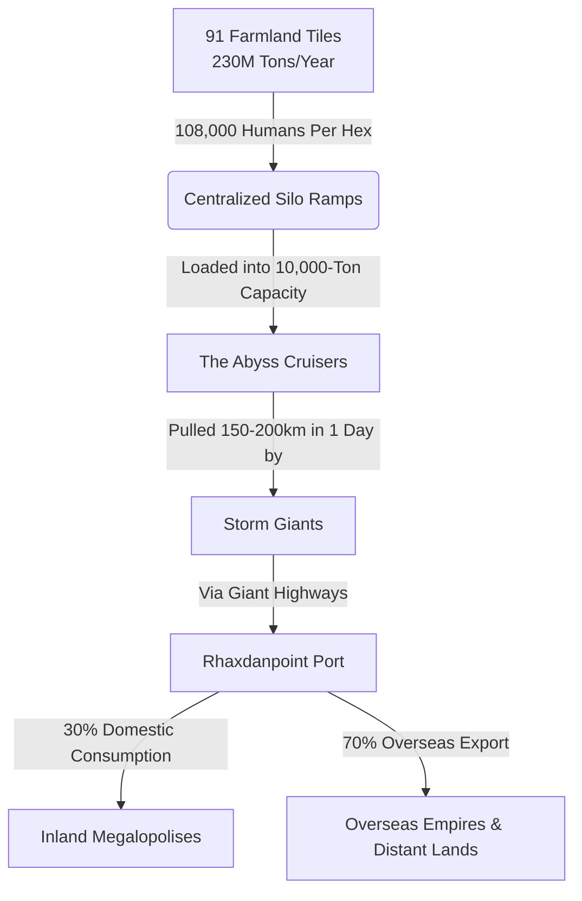

The **Blue Lake Region** (comprising 91 interconnected Farmland Tiles) is the undisputed breadbasket of the known world. It operates not as a standard feudal countryside, but as a monumental magi-industrial food engine. This region is solely responsible for producing **230,000,000 tons of food annually** to sustain approximately **657,000,000 consumers** across the world, primarily feeding the massive, hungry empires across the sea.

> [!infobox]
> ### Region Logistics at a Glance
> - **Total Farmland Tiles:** 91 Hexes
> - **Population per Hex:** 108,000 Humans + 1 Storm Giant
> - **Annual Production:** ~230,000,000 Tons (Global)
> - **Daily Export:** ~630,000 Tons (Distributed across the network)
> - **Primary Shipping Hub:** [[Rhaxdanpoint]] (Export Megapolis)
> - **Logistics Controllers:** [[House Brightwater]]
## The Logistical Flow

Because **Teleportation Circles do not exist** in this setting, the survival of millions relies entirely on a mechanical and magical marvel: a seamless combination of pocket-dimension engineering and raw, primordial strength.

## The Masterpieces of Logistics

### 1. The Abyss Cruisers (Dimensional Wagons)
The backbone of global survival consists of exactly **91 unique, magically engineered wagons**—one assigned to each Farmland Tile. 

* **The Spatial Anchor:** Externally, an Abyss Cruiser resembles a heavily reinforced, three-story wooden and iron manor built upon six massive, iron-shod wheels. Inside its silver-rimmed rear vault lies a perfectly stable, cold, and sterile **pocket dimension** capable of containing exactly **10,000 tons of grain, flour, or dried provisions**.
* **Weight Neutralization:** Through ancient spatial runes woven by House Brightwater, the mass inside the pocket dimension is entirely severed from the material plane. Whether empty or fully loaded with 10,000 tons of food, the cruiser weighs roughly **2 tons** (the physical weight of its wood and iron frame).
* **The Captain’s Cabin:** Each Cruiser is a sovereign estate on wheels. The first floor features a luxurious suite housing a direct scion or trusted high-magister of House Brightwater. They are the setting's elite merchant-captains, commanding wealth equivalent to dukes.
### 2. Storm Giant Draft-Lords
While an Abyss Cruiser physically weighs only 2 tons and could be moved by a standard draft team, the **Storm Giant** of each tile serves as its exclusive engine.

* **Monumental Speed:** Using heavily reinforced, rune-carved chains slung over their massive shoulders, the Storm Giants drag the Cruisers along the designated **Giant Highways**. Due to their titanic stride, a Storm Giant can haul a Cruiser across an entire massive hex (~150–200 km) in **a single day**, bypassing weeks of mundane travel.
* **Climatic Preservation:** As creatures of the storm, the Giants instinctively regulate the weather surrounding their Cruiser. They push away muddy downpours and humid frontlines, ensuring the roads stay hard-packed and the Cruiser's exterior structure remains dry.
* **Absolute Protection:** No bandit faction, beast, or standard militia dares ambush a wagon guarded and pulled by an 8-meter-tall living avatar of thunder. 
## Faction Focus: House Brightwater

Operating out of the maritime megapolis of **[[Rhaxdanpoint]]** (which is not a political capital, but the world's largest trade hub), **House Brightwater** holds a total monopoly on sauszemes (overland) logistics.

* **The Bloodline Secret:** Only individuals carrying the Brightwater bloodline or their highly specialized magisters possess the volatile knowledge required to stabilize and repair the 10,000-ton spatial rifts within the Cruisers. If a Cruiser's runes begin to fracture, a Brightwater Engineer must be dispatched immediately.
* **The Overseer Dynamic:** Every week, 108,000 human laborers on a tile fill the Cruiser to its 10,000-ton capacity through the rear hopper. Once full, the Brightwater captain seals the vault, coordinates with the local Storm Giant, and begins the rapid one-day journey to the shipping docks of Rhaxdanpoint. 