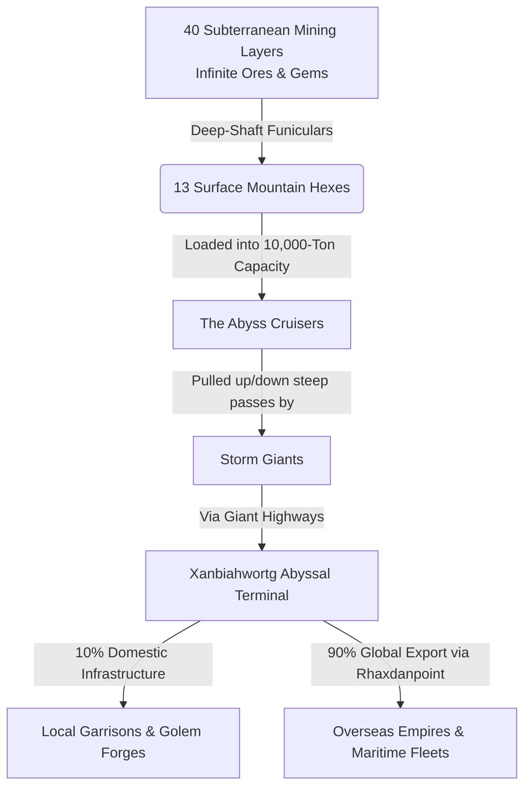

The **Deep-Root Peaks** (comprising 13 massive surface mountain hexes and a staggering 40 interconnected subterranean layers) is the heavy-metal forge of the known world. It operates as a brutalist, hyper-industrialized mining engine. This multi-layered vertical territory is solely responsible for extracting and smelting millions of tons of pristine iron, gold, platinum, and volatile arcane ores annually to fuel the world's machinery. While the surface is a jagged landscape of smoke-choked peaks, the true wealth lies beneath, where a labyrinth of 40 deep-subterranean grids claws out infinite resources under the absolute authority of **[[House Ironbound]]**.

> [!infobox]
> ### Region Logistics at a Glance
> - **Surface Footprint:** 13 Mountain Hexes (The Sky-Pits)
> - **Subterranean Depths:** 40 Interconnected Mining Layers (The Roots)
> - **Population per Surface Hex:** 108,000 Laborers + 1 Storm Giant
> - **Primary Industrial Output:** Refined Steel, Platinum Bricks, Golem Chassis, and Void-Ore
> - **Primary Shipping Hub:** [[Xanbiahwortg]] Megapolis (Abyssal Terminal)
> - **Logistics Controllers:** [[House Ironbound]]
## The Logistical Flow

Because **Teleportation Circles do not exist**, the massive exchange of resources between the mountain depths and the lowlands relies on vertical heavy machinery and the raw, earth-shaking draft power of Vētras milži (Storm Giants).

## The Vertical Infrastructure

### 1. The 13 Surface Peaks (The Sky-Pits)
The visible footprint of the mining engine consists of exactly 13 massive mountain hexes. These peaks have been completely reshaped by century-long industrial excavation.
* **The Smog-Choked Craters:** Entire mountainsides have been turned into tiered, open-pit quarries. Thousands of massive blast-furnaces burn day and night, powered by geothermal heat, filling the valleys with a perpetual sea of black soot and sulfurous ash.
* **The Cable-Car Networks:** Impossibly thick steel cables and steam-powered funicular railways bridge the gaps between the 13 isolated peaks, transporting worker crews and raw stone across miles of open air.

### 2. The 40 Subterranean Layers (The Roots)
Beneath the 13 surface peaks lies the true heart of the engine—a vertical labyrinth of 40 distinct, heavily colonized subterranean strata that descend deep into the roots of the world.
* **Layers 1 to 15 (The Industrial Grid):** These upper layers house the living tenements for millions of miners, mechanical sorting grids, and massive underground foundries. The air smells of cheap grease and hot iron.
* **Layers 16 to 30 (The Arcane Veins):** The deeper, highly guarded levels where House Ironbound extracts precious metals, gold, and platinum bricks. These layers are heavily reinforced with dzelzskoks (ironwood) from [[Drupsall]] to prevent structural collapses.
* **Layers 31 to 40 (The Deep Vaults):** The most dangerous and volatile frontier. Here, colossal steam-powered drills pierce the raw bedrock to extract veins of pristine gemstones, mithril, and mysterious, antimagic void-ores. This zone borders the Underdark and is under constant military lockdown.
## Faction Focus: House Ironbound

Operating from the high forge-courts of **[[Xanbiahwortg]]**, **[[House Ironbound]]** holds a total monopoly over the 13 surface peaks and 40 subterranean layers. 

* **The 200% Overseas Monopoly:** House Ironbound operates at a staggering 1,000% production surplus, extracting ten times more raw material than the local region could ever consume. While local automated defense networks receive iron at production cost, all overseas exports are heavily taxed. Refined weapons, platinum, and golem cores are shipped across the sea with a **brutal 200% markup (triple the production value)**, matching the immense wealth of [[House Brightwater]].
* **The Titan Chains:** House Ironbound coordinates with the region's 13 surface Storm Giants. The family provides the giants with legendary-tier magic items and lightning-infused gemstones in exchange for their continuous labor, dragging the 10,000-ton *Abyss Cruisers* up the treacherous mountain highways.
